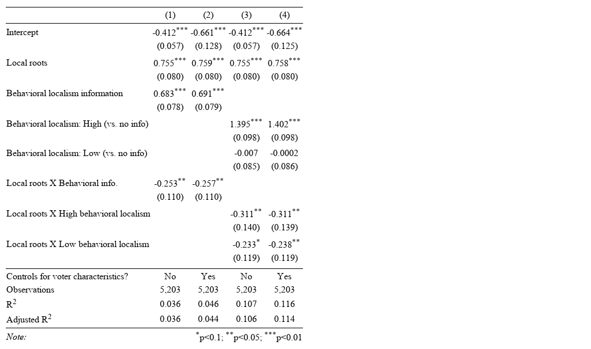

```{r setup, include=FALSE}
knitr::opts_chunk$set(echo = FALSE)
knitr::write_bib(c("book", "maria"), "bib.bib", width = 60)
library(tidyverse)
library(bookdown)
library(ggplot2)
library(sandwich)
library(lmtest)
library(stargazer)
library(cowplot)
library(cobalt)
library(xtable)
library(devtools)
library(margins)
library(car)
```

# Overview 

<i> Why Friends and Neighbors? Explaining the Electoral Appeal of Local Roots </i> by Rosie Campbell, Philip Cowley, Nick Vivyan, and Markus Wagner in the <i>The Journal of Politics</i> aims to answer the driving question of, "Why do politicians with strong local roots receive more electoral support?" by running and analyzing two separate studies. The first study uses a "paired profiles factorial vignette design" by asking subjects to rate hypothetical members of Parliament on a scale from 1 to 10. The hypothetical members have varying levels of local roots as well as varying levels of "behavioral localism"—their track record of constituency service and if they act more so as a trustee or delegate. The analysis which is largely visualized in figure 1 consists of both the raw difference in ratings between varying levels of local roots and across levels of behavioral localism. It then uses models to predict the effect of having local roots which can be seen on display in my "beautiful graphic" In the second study, subjects again considered hypothetical members of Parliament with varying levels of local roots as compared to varying levels of behavioral localism mainly in the first study. In this case, the subjects also received information on their political preferences and partisan loyalties. The first study depicted that the additional information swayed rankings, but local roots still seemed to have an association no matter what. The second study agreed with these results stating that, "even if voters are provided with a rich array of information about politicians’ behavior and ideological positioning, the effect of local roots remained positive and notable." The remainder of the article discusses the nuances of these results within the frame of the driving question. It also attempts to contextualize these findings with the broader literature of the effects off in-group/out-group dynamics in the context of localism @paper.

All analysis for this paper is available in my Github repository for this milestone is in the footnote below. ^[https://github.com/SamuelLowry/gov1006-milestone-5.git]

I used @book and @maria in order to help me complete this milestone.

\newpage

# Beautiful Graphic

I attempted to improve upon part of their figures that was very difficult to understand due to a lack of basic things such as proper titles.

```{r data}
#loaded in the data from the first study

d <- readRDS("paper_files/study1data.rds")

```

```{r graphic, warning=FALSE}
#warning = FALSE in order to get rid of unknown variable due to their code being wacl

#Here I pulled over their code but then tried to improve upon it, for currently the figure is unreadable. 

#models for this graphic and the table later on

m1 <- lm(nickminusphil ~ localtreat*behtreatsimple, data = d)
se1 <- sqrt(diag(vcovHC(m1)))

m2 <- lm(nickminusphil ~ localtreat*behtreatsimple +
           gender + agegrp + socgrade + qual
         , data = d)
se2 <- sqrt(diag(vcovHC(m2)))

m3 <- lm(nickminusphil ~ localtreat*behtreat, data = d)
se3 <- sqrt(diag(vcovHC(m3)))

m4 <- lm(nickminusphil ~ localtreat*behtreat +
           gender + agegrp + socgrade + qual
         , data = d)
se4 <- sqrt(diag(vcovHC(m4)))


# Figure 1
#I was very confused about B here especially because of the variability and the "no information" section being higher. 
## Avg treatment effect of local roots with const and westmihn. info

out <- summary(margins(m4, vcov = vcovHC(m4), 
                       at = list(behtreat = c("No behavioural info", "Const. focus", "Westmin. focus"))))
out <- subset(out, factor == "localtreatLocal roots")
margins.m4 <- out 

## make margins plot
#Changed around the labels to be more intuitive

margins.comb <- margins.m4
margins.comb$behtreat.neat <- car:::recode(margins.comb$behtreat, 
                                           '"No behavioural info" = "MP Work Behavior Information Given --\\nNo information (Vignettes 1-2)";
                                              "Westmin. focus" = "MP Work Behavior Information Given --\\nLow behavioral localism (Vignettes 5-6)";
                                              "Const. focus" = "MP Work Behavior Information Given --\\nHigh behavioral localism (Vignettes 3-4)"')
margins.comb$behtreat.neat <- factor(sub(" --", ":", margins.comb$behtreat.neat),
                                      levels = c("MP Work Behavior Information Given:\nNo information (Vignettes 1-2)", 
                                                   "MP Work Behavior Information Given:\nLow behavioral localism (Vignettes 5-6)",
                                                   "MP Work Behavior Information Given:\nHigh behavioral localism (Vignettes 3-4)"
                                     ))

#I added a caption
#Changed around the labels to be more intuitive

p1 <- ggplot(margins.comb, aes(x = factor, y = AME)) + 
  geom_hline(yintercept = 0, linetype = "dashed", size = 0.5) +
  geom_linerange(aes(x=factor, xend=factor, ymin=lower, ymax=upper), size = 0.6) +
  geom_point(size = 3.5, shape = 21, fill = "white") +
  labs(x = "", 
       y = "",
       caption = "The subjects of the experiment were given two hypothetical Members of Parliament (MP) to evaluate and asked,\n'On a scale ranging from 0 to 10, where 0 means very unhappy and 10 means very happy, how happy or unhappy\nwould you be to have each person as your Member of Parliament?'. This graphic depicts the estimated effect of the\nMP having local roots on that scale differing by the information given about the MP's focus on their immediate\ncommunity (behavioral localism). The lines denote 95% confidence intervals.") + 
  coord_flip() +
  facet_wrap( ~ behtreat.neat, ncol = 1) + 
  theme_bw() +
  theme(legend.position = "bottom") +
  theme(axis.ticks.y = element_blank(), axis.text.y = element_blank()) + 
  ggtitle("The Estimated Effect of MP Having Local Roots") +
  theme(plot.caption = element_text(hjust = 0))

p1
```

\newpage

# References

<div id="refs"></div>

\newpage

# (APPENDIX) Appendix {-} 

# Appendix

### Table from @paper {-} 

I used @images in order to help me figure out how to input the image. I used @cook in order to figure out how to put the appendix after references. 

```{r table, results='asis'}
#I took the code for table 2 from their code and made it output to Latex

m1 <- lm(nickminusphil ~ localtreat*behtreatsimple, data = d)

se1 <- sqrt(diag(vcovHC(m1)))

m2 <- lm(nickminusphil ~ localtreat*behtreatsimple +
           gender + agegrp + socgrade + qual
         , data = d)
se2 <- sqrt(diag(vcovHC(m2)))

m3 <- lm(nickminusphil ~ localtreat*behtreat, data = d)
se3 <- sqrt(diag(vcovHC(m3)))

m4 <- lm(nickminusphil ~ localtreat*behtreat +
           gender + agegrp + socgrade + qual
         , data = d)
se4 <- sqrt(diag(vcovHC(m4)))

stargazer(mget(paste0("m",1:4)),
          se = mget(paste0("se",1:4)),
          type = "latex",
          float = FALSE,
          dep.var.caption = "",
          dep.var.labels.include = FALSE,
          title = "", 
          #intercept.bottom = FALSE, intercept.top = TRUE,
          keep.stat = c("n", "rsq", "adj.rsq"),
          omit = "socgrade|agegrp|gender|qual",
          order = c("Constant", "^localtreatLocal roots$", 
                    "^behtreatsimpleBehavioural info$", 
                    "^behtreatConst. focus$", 
                    "^behtreatWestmin. focus$",
                    "^localtreatLocal roots:behtreatsimpleBehavioural info$",
                    "^localtreatLocal roots:behtreatConst. focus$",
                    "^localtreatLocal roots:behtreatWestmin. focus$"
          ),
          add.lines = list(c("Controls for voter characteristics?", 
                             rep(c("No","Yes"), 2))),
          covariate.labels = c("Intercept", "Local roots", "Behavioral localism information",
                               "Behavioral localism: High (vs. no info)",
                               "Behavioral localism: Low (vs. no info)",
                               "Local roots X Behavioral info.", 
                               "Local roots X High behavioral localism",
                               "Local roots X Low behavioral localism")
)
```

\newpage

Below is the image of the table from the paper itself. 

```{r}

```

